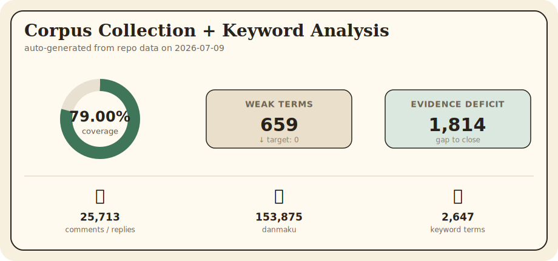
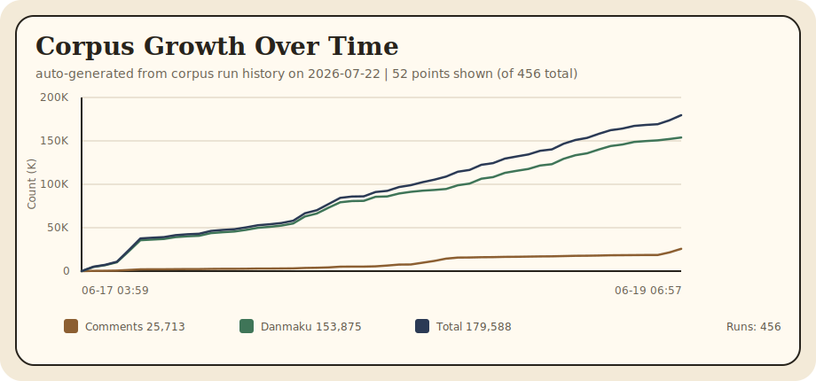

# Bilibili User Personality / 哔哩哔哩用户画像分析

Research-driven prototype for evaluating whether a selected Bilibili user's public comments show a high argumentative-trolling tendency.

研究驱动原型：评估选定B站用户的公开评论是否表现出高杠精/引战倾向。

> **Research Paper / 研究论文:** See [`docs/PROJECT_PAPER.md`](docs/PROJECT_PAPER.md) for a full paper describing the project's methodology, six-dimensional scoring framework, dictionary system, coverage loops, and system architecture. LaTeX source at [`docs/PROJECT_PAPER.tex`](docs/PROJECT_PAPER.tex). / 完整论文（Markdown格式）描述了项目方法论、六维评分框架、词典系统、覆盖循环和系统架构。LaTeX源文件见 `docs/PROJECT_PAPER.tex`。

---

## Quick Navigation / 快速导航

| I want to… / 我想要… | Section |
|---|---|
| Understand the project goals / 了解项目目标 | [Overview](#overview) / [项目概述](#项目概述) |
| Set up and run locally / 本地搭建运行 | [Run Locally](#run-locally) / [本地运行](#本地运行) |
| Harvest keywords from Bilibili / 从B站采集关键词 | [Configuration & Scripts](#configuration--scripts) / [配置与脚本](#配置与脚本) |
| Run the auto-coverage loop / 运行自动覆盖循环 | [Auto-Coverage Loop](#auto-coverage-loop) / [自动覆盖循环](#自动覆盖循环) |
| Run the harvest automatically every day / 每天自动运行采集任务 | [Daily Harvest Pipeline](docs/DAILY_HARVEST.md) / [每日采集流水线](docs/DAILY_HARVEST.md) |
| Run the local expansion loop / 运行本地扩展循环 | [Local Expansion Loop](#local-expansion-loop) / [本地扩展循环](#本地扩展循环) |
| Check dictionary coverage metrics / 查看词典覆盖指标 | [Current Dictionary Status](#current-dictionary-status) / [当前词典状态](#当前词典状态) |
| Enable semantic matching / 启用语义匹配 | [Semantic Matching](#semantic-matching) / [语义匹配](#语义匹配) |
| Scrape a specific user's comments / 抓取指定用户评论 | [UID Comment Scraping](#uid-comment-scraping) / [UID-用户评论抓取](#uid-用户评论抓取) |
| Scrape a favorite list / 抓取收藏夹 | [Favorite List Scraping](#favorite-list-scraping) / [收藏夹抓取](#收藏夹抓取) |
| Understand crawler design / 了解爬虫设计 | [Notes](#notes) / [备注](#备注) |
| Build for production / 生产构建 | [Build](#build) / [构建](#构建) |
| Delegate tasks to DeepSeek / 委托任务给DeepSeek | [Run Locally](#run-locally) / [本地运行](#本地运行) |
| Run parallel dictionary resolution / 并行词典解析 | [Configuration & Scripts](#configuration--scripts) / [配置与脚本](#配置与脚本) |
| Adjust crawler rate limits / 调整爬虫速率 | [Configuration & Scripts](#configuration--scripts) / [配置与脚本](#配置与脚本) |

---

<!-- stats-graph:start -->
## Data Growth / 数据增长





| Metric | Value |
|---|---:|
| Comments / replies | 25,713 |
| Danmaku | 153,875 |
| Keyword terms analyzed | 2,647 |
| Coverage ratio | 79.00% |
| Weak terms | 659 |
| Timeline points | 456 |

This block is generated by `npm run stats:update` and refreshed by GitHub Actions.
<!-- stats-graph:end -->

---

# English Documentation

## Overview

### What It Shows

- A radar chart tailored to adversarial-comment behavior rather than generic personality labels.
- A data-led trolling index derived from six interpretable dimensions:
  - Adversarial Motivation
  - Cognitive Closure
  - Evidence Sensitivity
  - Logical Consistency
  - Cooperative Discussion
  - Correction Willingness
- Three analysis modes:
  - **Hybrid**: Semantic behavior judgment + adaptive dictionary evidence
  - **Semantic Judge**: Evaluates targets, evidence burden, proposition response, and correction behavior
  - **Lexicon**: Transparent semantic-family matching, auditable
- **UID-based automatic sampling**:
  - Reads Bilibili public profile/card data
  - Discovers uploads and dynamics from Bilibili public endpoints
  - Scans comments and filters interactions by `mid`
  - Does not use AICU, third-party indexes, or external sites for UID comment scraping
- **Video keyword search**:
  - Accepts Bilibili video URLs or BV numbers in the same search box
  - Backend searches Bilibili videos, scans public comments, and trains keywords
  - Learned keywords are shown in the UI and merged into the local analyzer dictionary
- **DeepSeek V4 Chinese keyword training**:
  - Uses the DeepSeek API for dictionary extraction
  - Auto-coverage loop enforces `deepseek-v4-flash` (reasoning effort max)
  - Direct analysis and complex implementation work still use `deepseek-v4-pro`
  - Extracts Chinese internet slang, meanings, variants, and semantic families from crawled comments

### Quality Rules

- Coverage evidence must come from Bilibili public comments, replies, or danmaku (unless loose mode is explicitly selected).
- The crawler does not use AICU or third-party comment indexes as a substitute for local collection.
- Search-result titles aid discovery but strict mode does not count them as completed comment evidence.
- DeepSeek extracts dictionaries and judges sentence context; it does not fine-tune a local model.

---

---

## Current Dictionary Status

See the auto-generated [Data Growth](#data-growth-数据增长) block at the top of this README for live dictionary counts, coverage ratio, and charts — refreshed by `npm run stats:update` and GitHub Actions.

Live Bilibili API access requires `BILIBILI_COOKIE`. Without credentials, use the [local expansion loop](#local-expansion-loop) to mine the existing 512K-message local corpus for evidence boosts.

---

## Run Locally

### Start Server

```powershell
cd D:\Bilibili_User_Personality
npm install
.\set-deepseek-env.ps1
npm run server
```

- API Backend: `http://127.0.0.1:8787`
- Vite Frontend: typically `http://127.0.0.1:5191`

### Keyword Harvesting

Before running the harvest for the first time, set up your local links file
from the template — this keeps your Bilibili links out of version control:

```powershell
# 1. Copy the example template to your local links file
cp run-bilibili-video.example.ps1 run-bilibili-video.links.ps1

# 2. Edit run-bilibili-video.links.ps1 — replace the placeholder links
#    with your own Bilibili video URLs, space URLs, UIDs, or favorite links.

# 3. (Optional) Add your Bilibili cookie to fetch more comment pages.
```

The links file is gitignored — your links stay local. Processed links are
automatically removed from the file, so you can keep pasting new links.

```powershell
# Process links from run-bilibili-video.links.ps1 (5 comment pages for depth)
.\run-bilibili-video.ps1 -CommentPages 5

# Full dictionary coverage loop
.\run-bilibili-auto-coverage.ps1 -MaxCycles 5 -RoundsPerCycle 2 -MaxQueries 20 -DiscoveryLimit 8 -CommentPages 3
```

### Coverage Audit

```powershell
npm run dictionary:coverage
```

The audit writes to `server/keywordCoverageAudit.json`, exports human-readable queries to `server/keywordCoverageQueries.txt`, structured actions to `server/keywordCoverageActions.json`, and prints weak terms, zero-evidence terms, family gaps, and recommended next queries.

### Dictionary Pruning

```powershell
# General cleanup
npm run dictionary:prune

# Prune exhausted terms
npm run dictionary:prune-exhausted
```

### Delegate to DeepSeek

```powershell
.\run-deepseek-job.ps1 -Task "Fix dictionary merge logic" -Mode complex -Commit -Push
```

- `-Mode light` / `-Mode flash` → `deepseek-v4-flash`
- `-Mode complex` / `-Mode pro` → `deepseek-v4-pro`
- `-Mode auto` → auto-select based on task keywords

---

## Configuration & Scripts

### Video Discovery

```powershell
# Custom controversy queries
.\run-bilibili-video.ps1 -ControversyQuery "时政 评论区","游戏 节奏 评论区" -MaxQueries 20 -CommentPages 5

# Combine search and controversy
.\run-bilibili-video.ps1 -SearchQuery "阴阳怪气 评论区","杠精 评论区" -ControversyQuery "国际政治 评论区" -DiscoveryMode controversial -CommentPages 5
```

### Discovery Modes

| Mode | Description |
|---|---|
| `search` | Search using dictionary/seed queries |
| `controversial` | Rotate through controversial topic searches (default) |
| `popular` | Scan Bilibili popular videos |
| `mixed` | Combine search + popular |

### Parallel Resolver

```powershell
# Run near-target resolver in parallel across 3 worktrees
node server/resolveNearTargetTerms.js
# Use RESOLVE_OVERRIDE_TERMS to specify target terms
$env:RESOLVE_OVERRIDE_TERMS="term1,term2,term3"
$env:RESOLVE_VIDEOS_PER_TERM="5"
$env:RESOLVE_PAGES="3"
$env:RESOLVE_BATCH="80"
node server/resolveNearTargetTerms.js
```

### Crawler Pacing

```powershell
$env:BILIBILI_CRAWLER_MIN_DELAY_MS="900"
$env:BILIBILI_CRAWLER_JITTER_MS="700"
$env:BILIBILI_CRAWLER_BLOCK_COOLDOWN_MS="45000"
$env:BILIBILI_CRAWLER_CACHE_TTL_MS="120000"
```

---

## Auto-Coverage Loop

### How It Works

1. **Audit**: Check each dictionary term's Bilibili comment evidence count
2. **Query Generation**: Generate Bilibili search queries for weak-evidence terms
3. **Harvest**: Search videos and scan comments/danmaku
4. **Validate**: Verify via DeepSeek that comments contain the term
5. **Prune**: Remove terms that remain unverifiable after multiple attempts
6. **Repeat**: Loop until the coverage target is reached

### Key Env Vars

| Variable | Description | Default |
|---|---|---|
| `BILIBILI_COVERAGE_LOOP_MAX_CYCLES` | Max cycles | `3` |
| `BILIBILI_HARVEST_MAX_QUERIES` | Queries per cycle | `12` |
| `BILIBILI_VIDEO_DISCOVERY_MODE` | Discovery mode | `search` |
| `BILIBILI_HARVEST_QUERY_TIMEOUT_MS` | Per-query timeout (ms) | `180000` |
| `BILIBILI_HARVEST_PRUNE_EXHAUSTED_AFTER` | Prune threshold | `0` (off) |
| `BILIBILI_HARVEST_TARGET_EVIDENCE` | Target evidence per term | `3` |
| `BILIBILI_HARVEST_PREFILTER_COMMENTS` | Pre-filter comments | `1` |
| `BILIBILI_HARVEST_DEEPEN_REPLIES` | Deepen reply trees | `1` |
| `BILIBILI_HARVEST_INCLUDE_DANMAKU` | Include danmaku | `1` |
| `BILIBILI_HARVEST_EXISTING_TERMS_ONLY` | Existing terms only | `1` |
| `DEEPSEEK_MODEL` | DeepSeek model | `deepseek-v4-flash` |

### Convergence Path

Convergence to ~100% coverage requires:

1. **Sustained Harvesting**: Repeatedly run the auto-coverage loop
2. **Exhausted Term Pruning**: Set `BILIBILI_HARVEST_PRUNE_EXHAUSTED_AFTER=3` to drop terms that remain unverifiable after multiple attempts
3. **Parallelization**: Split weak terms into batches and run near-target resolvers in parallel across isolated worktrees
4. **Merge Results**: Use `node server/mergeAgentDictionaries.js` to merge parallel agent outputs

> 📅 **Run it daily, unattended.** `daily-harvest.ps1` wraps this loop with a process lock, dated logs, and bounded defaults; `register-daily-harvest.ps1` installs a Windows Task Scheduler entry. Full guide → [Daily Harvest Pipeline](docs/DAILY_HARVEST.md).

---

## Local Expansion Loop

When `BILIBILI_COOKIE` is not available, this loop mines the existing local corpus (available corpus files total ~10.5MB) for evidence boosts. It does not require Bilibili API access.

> ⚠️ **Status update (June 2026):** The `seed_results*/` directories no longer exist and `tiebaKeywordCorpus.json` was removed with the Tieba scraper. The DeepSeek-based `npm run dictionary:expand` path is non-functional without seed results. **The Python text-matching miner (`dictionary:mine-local`) is now the only effective mining path** — use it with explicit corpus paths that actually exist.

### Most Effective Command

Run the Python miner against all existing corpus files, then audit:

```powershell
# One-shot: mine evidence from all existing corpora, then audit
$env:LOCAL_CORPUS_WRITE="1"
$env:LOCAL_BILIBILI_CORPUS_PATH="server/data/uid-discovery-comments.json,server/data/bilibiliHistoryTagCorpus.json,server/data/bilibiliDirectProbeCorpus.json,server/data/huggingFaceKeywordCorpus.json,server/data/scoredCommentCorpus.json,server/data/annotationCorpus.json"
python -m python_backend.cli.local_corpus_mine --write
npm run dictionary:coverage
```

Or as a one-liner for repeated use:

```powershell
LOCAL_CORPUS_WRITE=1 LOCAL_BILIBILI_CORPUS_PATH="server/data/uid-discovery-comments.json,server/data/bilibiliHistoryTagCorpus.json,server/data/bilibiliDirectProbeCorpus.json,server/data/huggingFaceKeywordCorpus.json,server/data/scoredCommentCorpus.json,server/data/annotationCorpus.json" python -m python_backend.cli.local_corpus_mine --write && npm run dictionary:coverage && npm run stats:update
```

> **Why explicit paths?** The default corpus list includes the removed `tiebaKeywordCorpus.json`, which causes a load failure. Explicitly listing only existing files avoids this and covers ~10.5MB of Bilibili comments and danmaku.

### How It Works

1. **Mine Local** (`python -m python_backend.cli.local_corpus_mine --write`): Python text-matching algorithm scans all specified corpus files for evidence of dictionary terms. Matches found with sufficient context are merged into the dictionary's evidence shards.
2. **Audit** (`npm run dictionary:coverage`): Re-audits coverage → updates `keywordCoverageAudit.json`.
3. **Stats** (`npm run stats:update`): Regenerates README stats block and SVG graphs.
4. **Repeat**: Loop until coverage plateaus.

### Key Env Vars

| Variable | Description | Default |
|---|---|---|
| `LOCAL_CORPUS_WRITE` | Merge mined evidence into dictionary (`1` = yes) | (dry run) |
| `LOCAL_BILIBILI_CORPUS_PATH` | Comma-separated corpus file paths | (see below) |
| `LOCAL_CORPUS_MAX_SAMPLES_PER_TERM` | Max evidence samples to collect per term | `3` |
| `BILIBILI_COVERAGE_TARGET_EVIDENCE` | Minimum evidence required per term | `3` |

**Default corpus paths** (used when `LOCAL_BILIBILI_CORPUS_PATH` is not set):
```
server/data/uid-discovery-comments.json
server/data/bilibiliDirectProbeCorpus.json
server/data/tiebaKeywordCorpus.json  (⚠️ removed — causes load failure)
server/data/huggingFaceKeywordCorpus.json
```

### Corpus Files Available

| File | Size | Description |
|---|---|---|
| `server/data/uid-discovery-comments.json` | 7.8 MB | **Main corpus** — UID-level discovery scrapes |
| `server/data/bilibiliHistoryTagCorpus.json` | 2.3 MB | History-tag seed corpus |
| `server/data/annotationCorpus.json` | 255 KB | Labeled annotation data |
| `server/data/scoredCommentCorpus.json` | 143 KB | Previously scored judgments |
| `server/data/bilibiliDirectProbeCorpus.json` | 31 KB | Direct probe results |
| `server/data/huggingFaceKeywordCorpus.json` | 6.9 KB | Hugging Face dataset import |

### Expected Yield

| Metric | Per run (all corpora, ~10.5MB) |
|---|---|
| Evidence matches for existing terms | ~200–500 |
| Coverage delta | ~1–5% |
| Terms moved above target (3 evidence) | ~50–200 |

Coverage gains diminish with each run as the corpus is exhausted. When the miner returns mostly existing matches, it's time to expand the corpus (via Bilibili scraping, Hugging Face imports, etc.).

---

## Build

```bash
npm run build
```

---

## Semantic Matching

Semantic matching supplements exact substring matching by accepting comments whose meaning is similar to a term's definition even when the term doesn't appear literally. It targets rare slang that is "understood but not explicitly written."

### How It Works

1. Uses local `@xenova/transformers` (model `Xenova/all-MiniLM-L6-v2`, 384-dim vectors) to generate embeddings for each dictionary term, cached to `server/semanticTermEmbeddings.json`.
2. When collecting comments, chunks them by sentence, embeds each chunk, and computes cosine similarity against all terms.
3. Similarity ≥ threshold (default 0.72) counts as semantic evidence, written to the dictionary with source marked as `[Semantic match, score=X.XXXX]`.

### Enabling

```powershell
$env:SEMANTIC_MATCH_ENABLED="1"
$env:SEMANTIC_MATCH_THRESHOLD="0.72"   # optional
$env:SEMANTIC_MATCH_MAX_CHUNKS="50"    # optional
```

When enabled, semantic matching runs automatically inside `trainKeywordDictionary`. Exact matching remains the primary path; semantic matching only supplements.

### Model Note

The local model has limited semantic understanding of niche Chinese internet slang (~27% of weak terms match their own samples above 0.72). It helps for common-vocabulary terms but won't close the gap alone.

---

## UID Comment Scraping

Input a Bilibili UID to scrape the user's public comment data for dictionary evidence.

### Scraping Scope

| Source | Description |
|---|---|
| Own video interactions | Threads where the user replied on their own content (videos/dynamics) |
| Public comment history | Comments the user wrote on any video, via `x/v2/reply/search?mid={uid}` |
| All comments on user's videos | Full comment sections on the user's uploads (not limited to threads the user participated in) |
| Dynamic posts | Authored dynamic text |

### Usage

```powershell
# Via frontend UID input
# Or via API:
curl -X POST http://127.0.0.1:8787/api/bilibili/analyze-uid \
  -H "Content-Type: application/json" \
  -d '{"uid":"130960422","pagesPerObject":2}'
```

---

## Favorite List Scraping

Input a Bilibili favorite list URL or media_id to expand all videos in the list and scan their comments.

### Supported URL Formats

- `https://space.bilibili.com/{uid}/favlist?fid={media_id}`
- `https://www.bilibili.com/medialist/detail/ml{media_id}`
- Raw numeric media_id

### Usage

```powershell
# Via API directly:
curl -X POST http://127.0.0.1:8787/api/bilibili/video-keywords \
  -H "Content-Type: application/json" \
  -d '{"favoriteLink":"https://space.bilibili.com/123/favlist?fid=456","pages":2}'
```

**Note**: The favorite list API requires a Cookie (SESSDATA).

---

## Notes

### Crawler Design

The crawler is intentionally conservative: sequential requests, brief caching on success, capped pages, cooldown on rate limits rather than fast retries. It uses Bilibili public endpoints directly — no AICU, third-party comment indexes, or external websites.

### Rate-Limit Tuning

The PS1 scripts auto-compute crawler pacing from the query timeout. Adjust these env vars if you still hit -412 or -799 rate limits:

| Variable | Controls | Default (auto) |
|---|---|---|
| `BILIBILI_CRAWLER_MIN_DELAY_MS` | Min delay between requests | `max(2500, timeout/60)` |
| `BILIBILI_CRAWLER_JITTER_MS` | Random delay jitter added | `max(1500, timeout/120)` |
| `BILIBILI_CRAWLER_BLOCK_COOLDOWN_MS` | Cooldown after rate-limit block | `max(60000, timeout/3)` |
| `BILIBILI_CRAWLER_CACHE_TTL_MS` | Success cache TTL | `300000` |
| `BILIBILI_RATE_BURST` | Token bucket burst cap | `0` (use endpoint defaults) |
| `BILIBILI_RATE_SUSTAIN` | Token bucket sustain rate (req/s) | `0` (use endpoint defaults) |
| `BILIBILI_COOKIE` | Bilibili session cookie | (unset) |

Set these explicitly to override the auto-computed values:
```powershell
.\run-bilibili-auto-coverage.ps1 -CrawlerMinDelayMs 5000 -CrawlerBlockCooldownMs 120000 -BilibiliCookie "SESSDATA=..."
```

A logged-in cookie gives 5–10× higher rate limits.

### Scoring Framework

The scoring language is framed as behavior-risk analysis over a bounded public comment sample, not as a clinical diagnosis or definitive personality judgment.

### Dictionary Iteration

The dictionary harvester is iterative: run repeatedly for broader coverage. Model-generated keywords are accepted only when the cleaned term appears in crawled comments. Each entry includes `evidenceCount`, `evidenceSamples`, and `evidenceSources` for auditability.

### Parallel Resolver Merge

After parallel execution, merge evidence from all worktrees:

```powershell
node server/mergeAgentDictionaries.js .claude/worktrees/resolver-1 .claude/worktrees/resolver-2 .claude/worktrees/resolver-3
```

Then run a coverage audit to measure improvement:

```powershell
npm run dictionary:coverage
```

---

# 中文文档

## 项目概述

### 功能

- 针对杠精行为定制的雷达图，而非通用的性格标签。
- 数据驱动的"杠精指数"，从六个可解释维度得出：
  - 对抗性动机
  - 认知闭合
  - 证据敏感
  - 逻辑一致
  - 合作讨论
  - 修正意愿
- 三种分析模式：
  - **混合模式**: 语义行为判断 + 自适应词典证据
  - **语义判断模式**: 评估目标、证据负担、命题回应和修正行为
  - **词典模式**: 透明的语义族匹配，可审计
- **基于UID的自动采样**:
  - 读取B站公开资料/卡片数据
  - 从B站公开端点发现投稿和动态
  - 扫描评论并按 `mid` 过滤互动
  - 不使用AICU、第三方索引或外部网站替代UID评论爬取
- **视频关键词搜索**:
  - 在同一搜索框中接受B站视频URL或BV号
  - 后端搜索B站视频、扫描公开评论并训练关键词
  - UI中显示学到的关键词，并合并到本地分析器词典中
- **DeepSeek V4 中文关键词训练**:
  - 使用DeepSeek API进行词典提取
  - 自动覆盖循环强制使用 `deepseek-v4-flash`（推理力度max）
  - 直接分析和复杂实现工作仍可使用 `deepseek-v4-pro`
  - 从爬取的评论中提取中文网络用语、含义、变体和语义族

### 质量规则

- 覆盖证据必须来自B站公开评论、回复或弹幕（除非明确选择宽松模式）。
- 爬虫不使用AICU或第三方评论索引替代本地收集。
- 搜索结果标题可用于辅助发现，但严格模式不将其视为完成的评论证据。
- DeepSeek用作词典提取器和句子上下文判断器，不微调本地模型。

---

## 当前词典状态

实时词典数据请查看 README 顶部的[数据增长](#data-growth-数据增长)自动生成块——由 `npm run stats:update` 和 GitHub Actions 自动刷新。

实时 Bilibili API 访问需要 `BILIBILI_COOKIE`。无凭证时使用[本地扩展循环](#本地扩展循环)从现有的 512K 消息本地语料库中挖掘证据。

---

## 本地运行

### 启动服务

```powershell
cd D:\Bilibili_User_Personality
npm install
.\set-deepseek-env.ps1
npm run server
```

- API 后端: `http://127.0.0.1:8787`
- Vite 前端: 通常 `http://127.0.0.1:5191`

### 关键词采集

首次运行前，请从模板设置本地链接文件 — 这样可以保持你的B站链接不进入版本控制：

```powershell
# 1. 复制示例模板到本地链接文件
cp run-bilibili-video.example.ps1 run-bilibili-video.links.ps1

# 2. 编辑 run-bilibili-video.links.ps1 — 将占位链接替换为你自己的
#    B站视频URL、空间URL、UID或收藏夹链接。

# 3. （可选）添加你的B站Cookie以获取更多评论页。
```

链接文件已加入 gitignore — 你的链接仅保存在本地。已成功处理的链接
会自动从文件中移除，因此你可以持续粘贴新的链接。

```powershell
# 处理 run-bilibili-video.links.ps1 中的链接（5页评论以获得更深覆盖）
.\run-bilibili-video.ps1 -CommentPages 5

# 完整词典覆盖循环
.\run-bilibili-auto-coverage.ps1 -MaxCycles 5 -RoundsPerCycle 2 -MaxQueries 20 -DiscoveryLimit 8 -CommentPages 3
```

### 覆盖审计

```powershell
npm run dictionary:coverage
```

审计写入 `server/keywordCoverageAudit.json`、导出可读查询到 `server/keywordCoverageQueries.txt`、结构化动作到 `server/keywordCoverageActions.json`，并打印弱术语、零证据术语、家族缺口和推荐的下一步查询。

### 词典清理

```powershell
# 普通清理
npm run dictionary:prune

# 精简用尽术语
npm run dictionary:prune-exhausted
```

### DeepSeek 任务委托

```powershell
.\run-deepseek-job.ps1 -Task "修复词典覆盖合并逻辑" -Mode complex -Commit -Push
```

- `-Mode light` / `-Mode flash` → `deepseek-v4-flash`
- `-Mode complex` / `-Mode pro` → `deepseek-v4-pro`
- `-Mode auto` → 根据任务关键词自动选择

---

## 配置与脚本

### 视频发现

```powershell
# 自定义争议查询
.\run-bilibili-video.ps1 -ControversyQuery "时政 评论区","游戏 节奏 评论区" -MaxQueries 20 -CommentPages 5

# 混合搜索和争议
.\run-bilibili-video.ps1 -SearchQuery "阴阳怪气 评论区","杠精 评论区" -ControversyQuery "国际政治 评论区" -DiscoveryMode controversial -CommentPages 5
```

### 发现模式

| 模式 | 说明 |
|---|---|
| `search` | 使用词典/种子查询搜索 |
| `controversial` | 轮换争议话题搜索（默认） |
| `popular` | 扫描B站热门视频 |
| `mixed` | 组合 search + popular |

### 并行解析器

```powershell
# 在3个工作树中并行运行近目标解析器
node server/resolveNearTargetTerms.js
# 使用 RESOLVE_OVERRIDE_TERMS 指定目标术语
$env:RESOLVE_OVERRIDE_TERMS="术语1,术语2,术语3"
$env:RESOLVE_VIDEOS_PER_TERM="5"
$env:RESOLVE_PAGES="3"
$env:RESOLVE_BATCH="80"
node server/resolveNearTargetTerms.js
```

### 爬虫调速

```powershell
$env:BILIBILI_CRAWLER_MIN_DELAY_MS="900"
$env:BILIBILI_CRAWLER_JITTER_MS="700"
$env:BILIBILI_CRAWLER_BLOCK_COOLDOWN_MS="45000"
$env:BILIBILI_CRAWLER_CACHE_TTL_MS="120000"
```

---

## 自动覆盖循环

### 工作原理

1. **审计**: 检查每个词典术语的B站评论证据数
2. **查询生成**: 为弱证据术语生成B站搜索查询
3. **采集**: 搜索视频并扫描评论/弹幕
4. **验证**: 通过DeepSeek验证评论是否包含术语
5. **精简**: 移除多次尝试后仍无法证实的术语
6. **重复**: 循环直至达到覆盖目标

### 关键环境变量

| 变量 | 说明 | 默认 |
|---|---|---|
| `BILIBILI_COVERAGE_LOOP_MAX_CYCLES` | 最大周期数 | `3` |
| `BILIBILI_HARVEST_MAX_QUERIES` | 每周期查询数 | `12` |
| `BILIBILI_VIDEO_DISCOVERY_MODE` | 发现模式 | `search` |
| `BILIBILI_HARVEST_QUERY_TIMEOUT_MS` | 每查询超时(ms) | `180000` |
| `BILIBILI_HARVEST_PRUNE_EXHAUSTED_AFTER` | 精简阈值 | `0`（关闭） |
| `BILIBILI_HARVEST_TARGET_EVIDENCE` | 目标证据数 | `3` |
| `BILIBILI_HARVEST_PREFILTER_COMMENTS` | 评论预过滤 | `1` |
| `BILIBILI_HARVEST_DEEPEN_REPLIES` | 回复树深化 | `1` |
| `BILIBILI_HARVEST_INCLUDE_DANMAKU` | 包含弹幕 | `1` |
| `BILIBILI_HARVEST_EXISTING_TERMS_ONLY` | 仅现有术语 | `1` |
| `DEEPSEEK_MODEL` | DeepSeek模型 | `deepseek-v4-flash` |

### 收敛路径

收敛到~100%覆盖率需要：

1. **持续采集**: 重复运行自动覆盖循环
2. **用尽术语精简**: 设置 `BILIBILI_HARVEST_PRUNE_EXHAUSTED_AFTER=3` 以在多次尝试后移除无法证实的术语
3. **平行化**: 将弱术语分批，在独立工作树中并行运行近目标解析器
4. **合并结果**: 使用 `node server/mergeAgentDictionaries.js` 合并并行agent的输出

> 📅 **每天无人值守自动运行。** `daily-harvest.ps1` 为本循环加上了进程锁、按日期归档的日志与有界的默认参数；`register-daily-harvest.ps1` 用于注册 Windows 任务计划。完整指南 → [每日采集流水线](docs/DAILY_HARVEST.md)。

---

## 本地扩展循环

当 `BILIBILI_COOKIE` 不可用时，此循环从现有的本地语料库（可用语料文件总计约 10.5MB）中挖掘证据。无需 Bilibili API 访问。

> ⚠️ **状态更新（2026年6月）：** `seed_results*/` 目录已不存在，`tiebaKeywordCorpus.json` 也随贴吧爬虫一起被移除。`npm run dictionary:expand` 的 DeepSeek 路径因缺少种子结果而无法使用。**Python 文本匹配挖掘器 (`dictionary:mine-local`) 现在是唯一有效的挖掘路径**——使用时应显式指定实际存在的语料文件路径。

### 最有效命令

针对所有现有语料文件运行 Python 挖掘器，然后审计：

```powershell
# 一次性：从所有现有语料库挖掘证据，然后审计
$env:LOCAL_CORPUS_WRITE="1"
$env:LOCAL_BILIBILI_CORPUS_PATH="server/data/uid-discovery-comments.json,server/data/bilibiliHistoryTagCorpus.json,server/data/bilibiliDirectProbeCorpus.json,server/data/huggingFaceKeywordCorpus.json,server/data/scoredCommentCorpus.json,server/data/annotationCorpus.json"
python -m python_backend.cli.local_corpus_mine --write
npm run dictionary:coverage
```

或单行命令：

```powershell
LOCAL_CORPUS_WRITE=1 LOCAL_BILIBILI_CORPUS_PATH="server/data/uid-discovery-comments.json,server/data/bilibiliHistoryTagCorpus.json,server/data/bilibiliDirectProbeCorpus.json,server/data/huggingFaceKeywordCorpus.json,server/data/scoredCommentCorpus.json,server/data/annotationCorpus.json" python -m python_backend.cli.local_corpus_mine --write && npm run dictionary:coverage && npm run stats:update
```

> **为什么需要显式路径？** 默认语料文件列表包含已移除的 `tiebaKeywordCorpus.json`，会导致加载失败。显式列出仅存在的文件可避免此问题，覆盖约 10.5MB 的 B 站评论和弹幕数据。

### 工作原理

1. **本地挖掘** (`python -m python_backend.cli.local_corpus_mine --write`): Python 文本匹配算法扫描指定语料文件，寻找词典术语的证据。找到的匹配项（含上下文）合并至词典的证据分片中。
2. **审计** (`npm run dictionary:coverage`): 重新审计覆盖率 → 更新 `keywordCoverageAudit.json`。
3. **统计** (`npm run stats:update`): 重新生成 README 统计块和 SVG 图表。
4. **循环**: 重复直至覆盖率趋于稳定。

### 关键环境变量

| 变量 | 描述 | 默认值 |
|---|---|---|
| `LOCAL_CORPUS_WRITE` | 将挖掘的证据合并至词典（`1` = 是） | （试运行） |
| `LOCAL_BILIBILI_CORPUS_PATH` | 逗号分隔的语料文件路径列表 | （见下文） |
| `LOCAL_CORPUS_MAX_SAMPLES_PER_TERM` | 每个术语最多收集的证据样本数 | `3` |
| `BILIBILI_COVERAGE_TARGET_EVIDENCE` | 每个术语所需的最少证据数 | `3` |

**默认语料路径**（当 `LOCAL_BILIBILI_CORPUS_PATH` 未设置时）：
```
server/data/uid-discovery-comments.json
server/data/bilibiliDirectProbeCorpus.json
server/data/tiebaKeywordCorpus.json  (⚠️ 已移除，会导致加载失败)
server/data/huggingFaceKeywordCorpus.json
```

### 可用语料文件

| 文件 | 大小 | 说明 |
|---|---|---|
| `server/data/uid-discovery-comments.json` | 7.8 MB | **主语料库** — UID 级发现抓取 |
| `server/data/bilibiliHistoryTagCorpus.json` | 2.3 MB | 历史标签种子语料 |
| `server/data/annotationCorpus.json` | 255 KB | 标注的注释数据 |
| `server/data/scoredCommentCorpus.json` | 143 KB | 已评分判断数据 |
| `server/data/bilibiliDirectProbeCorpus.json` | 31 KB | 直接探测结果 |
| `server/data/huggingFaceKeywordCorpus.json` | 6.9 KB | Hugging Face 数据集导入 |

### 预期产出

| 指标 | 每次运行（全部语料，约 10.5MB） |
|---|---|
| 现有术语的证据匹配 | ~200–500 |
| 覆盖率增量 | ~1–5% |
| 达到目标（3条证据）的术语 | ~50–200 |

随着语料库被逐步发掘，每次运行的覆盖率增量会递减。当挖掘器主要返回已存在的匹配时，说明需要通过 B 站抓取、Hugging Face 导入等方式扩充语料库。

---

## 构建

```bash
npm run build
```

---

## 语义匹配

语义匹配作为精确子串匹配的补充：即使词典术语没有字面出现在评论中，只要含义相似即可接受为证据，用于覆盖那些"懂但不说"的稀有俚语。

### 工作原理

1. 使用本地 `@xenova/transformers`（模型 `Xenova/all-MiniLM-L6-v2`，384维向量）为每个词典术语生成嵌入向量，缓存至 `server/semanticTermEmbeddings.json`。
2. 收集评论时，将评论按句子分块并嵌入，计算与所有术语的余弦相似度。
3. 相似度 ≥ 阈值（默认 0.72）则作为语义证据写入词典，来源标记为 `[Semantic match, score=X.XXXX]`。

### 启用

```powershell
$env:SEMANTIC_MATCH_ENABLED="1"
$env:SEMANTIC_MATCH_THRESHOLD="0.72"   # 可选
$env:SEMANTIC_MATCH_MAX_CHUNKS="50"    # 可选
```

在采集或解析器中启用后，语义匹配会自动在 `trainKeywordDictionary` 内运行，无须代码改动。精确匹配仍为主路径；语义匹配仅补充。

### 模型说明

本地模型对中文网络俚语的语义理解有限（约 27% 弱证据术语能从自身样本中获得 ≥0.72 的相似度）。语义匹配对常用词汇术语有一定帮助，但无法单靠它填补所有证据缺口。

---

## UID 用户评论抓取

输入 B 站用户 UID，抓取该用户的公开评论数据作为词典证据来源。

### 抓取范围

| 数据来源 | 说明 |
|---|---|
| 用户自己的视频互动 | 用户在自己视频/动态中参与的评论线程 |
| 用户公开评论历史 | 通过 `x/v2/reply/search?mid={uid}` 获取用户在任何视频下的评论 |
| 用户视频的全部评论 | 用户投稿视频的完整评论区（不仅限于用户参与的线程） |
| 动态原文 | 用户发布的动态文本 |

### 使用

```powershell
# 通过前端输入 UID
# 或通过 API:
curl -X POST http://127.0.0.1:8787/api/bilibili/analyze-uid \
  -H "Content-Type: application/json" \
  -d '{"uid":"130960422","pagesPerObject":2}'
```

---

## 收藏夹抓取

输入 B 站收藏夹链接或 media_id，自动展开收藏夹中的视频列表并扫描全部评论。

### 支持的 URL 格式

- `https://space.bilibili.com/{uid}/favlist?fid={media_id}`
- `https://www.bilibili.com/medialist/detail/ml{media_id}`
- 纯数字 media_id

### 使用

```powershell
# 通过 API 直接传入:
curl -X POST http://127.0.0.1:8787/api/bilibili/video-keywords \
  -H "Content-Type: application/json" \
  -d '{"favoriteLink":"https://space.bilibili.com/123/favlist?fid=456","pages":2}'
```

**注意**：收藏夹 API 需要 Cookie（SESSDATA）。

---

## 备注

### 爬虫设计

爬虫有意保守：请求是顺序的、成功响应会短暂缓存、页面限制有上限、遇到限流会冷却而非快速重试。爬虫直接使用B站公开端点，不使用AICU、第三方评论索引或外部网站。

### 速率限制调优

PS1脚本会根据查询超时自动计算爬虫速率。如仍遇到 -412 或 -799 限流错误，调整以下环境变量：

| 变量 | 控制内容 | 默认值（自动） |
|---|---|---|
| `BILIBILI_CRAWLER_MIN_DELAY_MS` | 请求间最小延迟 | `max(2500, timeout/60)` |
| `BILIBILI_CRAWLER_JITTER_MS` | 随机延迟抖动 | `max(1500, timeout/120)` |
| `BILIBILI_CRAWLER_BLOCK_COOLDOWN_MS` | 限流后冷却时间 | `max(60000, timeout/3)` |
| `BILIBILI_CRAWLER_CACHE_TTL_MS` | 成功缓存TTL | `300000` |
| `BILIBILI_RATE_BURST` | 令牌桶突发上限 | `0`（使用端点默认） |
| `BILIBILI_RATE_SUSTAIN` | 令牌桶持续速率(req/s) | `0`（使用端点默认） |
| `BILIBILI_COOKIE` | B站会话Cookie | （未设置） |

显式设置以覆盖自动计算值：
```powershell
.\run-bilibili-auto-coverage.ps1 -CrawlerMinDelayMs 5000 -CrawlerBlockCooldownMs 120000 -BilibiliCookie "SESSDATA=..."
```

已登录Cookie可获得5–10倍的速率限制。

### 评分框架

评分语言被构建为基于有限公开评论样本的行为风险分析，而非临床诊断或确定性的个性判断。

### 词典迭代

词典采集是迭代的：重复运行以获得更广泛的覆盖。模型生成的关键词只有在清理后的术语能在爬取的评论文本中找到时才会被接受。每条术语包含 `evidenceCount`、`evidenceSamples` 和 `evidenceSources` 以便审计。

### 并行解析器合并

并行执行后，使用合并脚本收集所有工作树的证据：

```powershell
node server/mergeAgentDictionaries.js .claude/worktrees/resolver-1 .claude/worktrees/resolver-2 .claude/worktrees/resolver-3
npm run dictionary:coverage
```

---

## Multi-Round Corpus Mining / 多轮语料挖掘

Task-agnostic mining system for running long-duration (multi-hour to multi-day) corpus expansion jobs that survive session restarts. Each mining vector is a JSON task config; one generic runner handles all types; the Stop hook checks all active tasks.

任务无关的挖掘系统，用于运行长时间（数小时到数天）的语料扩展任务，支持会话重启后恢复。每个挖掘向量是一个 JSON 任务配置；一个通用运行器处理所有类型；Stop 钩子检查所有活跃任务。

### Architecture / 架构

```
.claude/tasks/<name>.json          ← Task config (type, rounds, batch size, output dirs)
.claude/resume_task.js             ← Generic runner (dispatches by task type)
.claude/hooks/stop-goal-check.cjs  ← Stop hook (scans all active task progress)
```

### Available Task Configs / 可用任务配置

| Task | Type | Items | Description |
|---|---|---|---|
| `deep-scrape` | bilibili-seed-scrape | 196 seeds | 4-round deep scrape of history seeds (pages 5/3/2 + harvest) / 历史种子四轮深度抓取 |
| `new-domains` | bilibili-seed-scrape | 60 seeds | Expand into gaming, tech, social domains / 扩展到游戏、科技、社会领域 |
| `keyword-search` | bilibili-keyword-search | 1,576 terms | Search Bilibili by each dictionary term / 按词典术语搜索B站 |
| `danmaku-deep` | bilibili-danmaku-deep | 500 videos | Fetch ALL danmaku (up to 5000/video) from top corpus videos / 抓取顶部视频全部弹幕 |

### Activation / 激活

Only one task should be active at a time. Edit the task config:

一次只应激活一个任务。编辑任务配置：

```json
{
  "name": "new-domains",
  "active": true,
  "..."
}
```

Deactivate the current task first:

先停用当前任务：

```powershell
# Edit .claude/tasks/deep_scrape.json → "active": false
# Edit .claude/tasks/new-domains.json → "active": true
```

### Running / 运行

Single-line goal prompt / 单行目标提示：

```
/goal Run node .claude/resume_task.js each turn — auto-detect active task, scrape batch, checkpoint per item, continue until done. Rate limits: 900ms delay, 700ms jitter, 45s cooldown on block.
```

CLI flags / 命令行参数:

| Flag | Effect / 效果 |
|---|---|
| `node .claude/resume_task.js` | Auto-pick first active task / 自动选择第一个活跃任务 |
| `node .claude/resume_task.js new-domains` | Run specific task / 运行指定任务 |
| `--batch=10` | Override items per turn (default from config) / 覆盖每轮条目数 |
| `--round=2` | Force a specific round (seed-scrape only) / 强制指定轮次 |

### Resumption / 断点续传

Every item is checkpointed immediately after scraping. Interruption (rate-limit, session end, manual stop) loses zero progress. Next turn, the runner reads the progress file and skips completed items.

每个条目抓取后立即保存进度。中断（限速、会话结束、手动停止）不会丢失进度。下一轮运行器读取进度文件并跳过已完成条目。

### Stop Hook Behavior / Stop 钩子行为

The Stop hook (`stop-goal-check.cjs`) blocks session exit until:

1. **Coverage audit** shows 100% ratio with 0 weak/zero terms, AND
2. **All active tasks** have their round/harvest flags marked done in their progress files

Inactive tasks (`"active": false`) are ignored. To release the hook, either complete the active task or set `"active": false`.

Stop 钩子在以下条件满足前阻止会话退出：

1. **覆盖审计**显示 100% 覆盖率且无弱/零证据术语，且
2. **所有活跃任务**在其进度文件中标记为完成

非活跃任务（`"active": false`）被忽略。要释放钩子，请完成活跃任务或将 `"active": false`。

### Task Lifecycle Example / 任务生命周期示例

```powershell
# 1. Activate a task
#    Edit .claude/tasks/new-domains.json → "active": true
#    Edit .claude/tasks/deep_scrape.json → "active": false

# 2. Run via goal prompt
#    /goal Run node .claude/resume_task.js each turn...

# 3. Runner auto-detects round, scrapes batch, checkpoints

# 4. When all rounds done → harvest evidence → coverage improves

# 5. Stop hook sees: coverage OK + active task done → approves exit

# 6. Deactivate, activate next task, repeat
```
